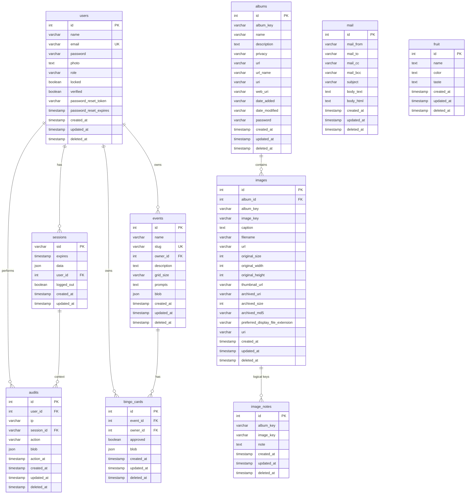

# SmugMug (Thalia) — data model

This page describes the MySQL schemas used by the **smugmug** site: tables re-exported from Thalia (`users`, `sessions`, `audits`, `albums`, `images`, `mail`) plus app-local models under `websites/smugmug/models/` (`fruit`, `image_notes`, `events`, `bingo_cards`).

## Entity–relationship diagram

### Notes on the diagram

- **`images.album_id`** is a **declared** Drizzle FK to **`albums.id`**. **`album_key`** on both `albums` and `images` matches **SmugMug API** identifiers; keep them consistent with sync jobs.
- **`image_notes`** is tied to a photo by **`(album_key, image_key)`** only — there is **no** `.references()` to **`images`**. Treat the link as **logical** until you add a unique constraint and FK (or store `image_id`).
- **`events.owner_id`** and **`bingo_cards.owner_id`** reference **`users.id`**; **`bingo_cards.event_id`** references **`events.id`** (defined in `websites/smugmug/models/bingo.ts`).
- **`albums`** has **no** `owner_user_id` in schema — gallery ownership is implied by SmugMug / sync code, not a local user FK.
- **`mail`** is independent of users/sessions (no `user_id`). Drizzle uses columns `from`, `to`, `cc`, `bcc`, `text`, `html` — the diagram uses **`mail_from`**, **`body_text`**, etc., so Mermaid avoids reserved words and duplicate `type name` pairs.
- **`audits`** event time is stored in MySQL as column **`timestamp`**; the diagram labels it **`action_at`** for clarity (same convention as Paperless `models.md`).
- **`fruit`** is a standalone demo-style table with **no** foreign keys.

## Table summary

| Table | Purpose |
|-------|---------|
| `albums` | Cached SmugMug album metadata (keys, URIs, privacy, dates). |
| `images` | Cached SmugMug image row per photo; **`album_id`** links to local `albums`. |
| `image_notes` | JSON/text blob per image (AI description, faces, EXIF, etc.) keyed by SmugMug **`album_key` + `image_key`**. |
| `events` | Bingo event: name, slug, grid size, prompt list, optional visibility blob. |
| `bingo_cards` | Player card for an event; **`blob`** holds cell prompts + SmugMug URLs after upload. |
| `users` | Thalia Security users (login, role, verification). |
| `sessions` | Session store; optional **`user_id`**. |
| `audits` | Security/audit log. |
| `mail` | Stored outbound mail payloads. |
| `fruit` | Simple example CRUD table (name, color, taste). |

## Suggested future additions

1. **`image_notes` ↔ `images`** — Add **`UNIQUE (album_key, image_key)`** on **`images`** (if not already) and either **`image_notes.image_id` FK** or a composite FK so notes cannot orphan.
2. **Indexes** — Composite index **`(album_key, image_key)`** on **`image_notes`** (and/or **`images`**) for fast lookups; **`bingo_cards (event_id, approved)`** for public galleries.
3. **Album ↔ user** — Optional **`albums.owner_user_id`** (or sync metadata: **`synced_by_user_id`**, **`last_synced_at`**) if multiple admins sync the same DB.
4. **SmugMug sync versioning** — **`smugmug_etag`**, **`last_modified_at`** on **`albums`/`images`** to drive incremental sync and conflict detection.
5. **Bingo** — **`bingo_card_cells`** normalized table if you need per-cell moderation, ordering, or queries without parsing JSON; keep **`blob`** for denormalized cache if preferred.
6. **Events ↔ galleries** — Optional **`events.featured_album_id`** or **`album_key`** if an event should bind to a SmugMug album in the DB.
7. **Retention / GDPR** — Flags or purge jobs for **`image_notes`** and **`bingo_cards.blob`** when users withdraw consent; document relationship to SmugMug deletes.
8. **`mail` ↔ user** — Optional **`user_id`** or **`trigger`** for per-user mail logs and resends (same pattern as Paperless `models.md`).
9. **`fruit`** — Remove or gate behind dev if it is only scaffolding; or prefix demo tables (`demo_fruit`) so production migrations stay clear.

---

*Generated from `websites/smugmug/models/*.ts`, Thalia `models/smugmug.ts`, `models/security-models.ts`, and `server/mail`.*
